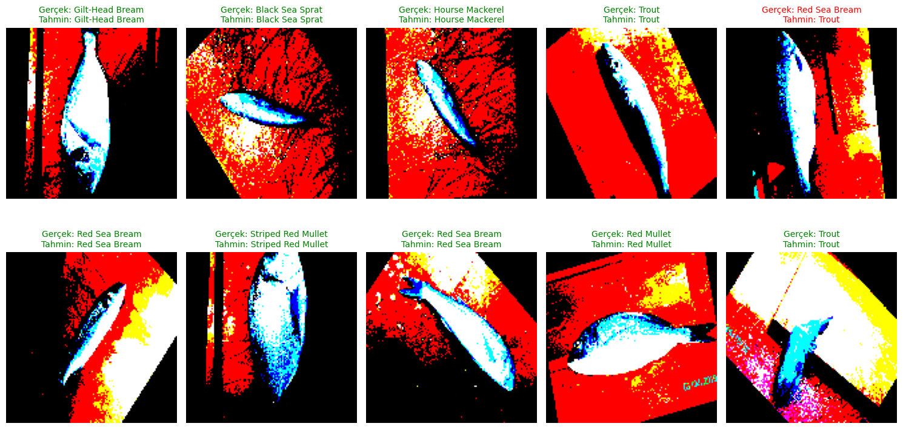

# Akbank-Deep-Learning-Project  : "A-Large-Scale-Fish-Dataset"

# Balık Türlerinin Yapay Sinir Ağları ile Sınıflandırılması

## 📌 # Balık Türü Sınıflandırma Projesi

## Proje Özeti
Bu projede derin öğrenme kullanılarak balık türlerini otomatik olarak sınıflandıran bir model geliştirilmiştir. Proje, görüntü işleme ve yapay sinir ağları teknolojilerini kullanarak balık türlerinin otomatik tanımlanmasını sağlamaktadır.

## Veri Seti
- **Kaynak**: Fish Dataset
- **İçerik**: Çeşitli balık türlerinin PNG formatında görüntüleri
- **Veri Hazırlama**:
  - Görüntüler 128x128 piksel boyutuna yeniden boyutlandırıldı
  - Veri seti %80 eğitim, %20 test olarak bölündü
  - Eğitim verisi içinden %20 doğrulama seti ayrıldı

## Model Mimarisi
Ardışık (Sequential) bir model kullanılarak şu katmanlar oluşturuldu:
1. **Giriş Katmanı**: Flatten (128x128x3 giriş)
2. **Gizli Katmanlar**:
   - Dense (256 nöron) + BatchNormalization + Dropout(0.2)
   - Dense (256 nöron) + BatchNormalization + Dropout(0.2)
   - Dense (128 nöron) + BatchNormalization + Dropout(0.2)
3. **Çıkış Katmanı**: Dense (sınıf sayısı) + Softmax aktivasyonu

## Model Eğitimi
- **Optimizer**: Adam
- **Loss Function**: Categorical Crossentropy
- **Metrics**: Accuracy
- **Epoch Sayısı**: 50
- **Batch Size**: 32

## Optimizasyon Teknikleri
1. **Early Stopping**:
   - Validation accuracy izlendi
   - 10 epoch sabır değeri
   - En iyi ağırlıklar kaydedildi

2. **Learning Rate Reduction**:
   - Validation accuracy izlendi
   - Faktör: 0.2
   - 5 epoch sabır değeri
   - Minimum learning rate: 0.00001

## Veri Artırma (Data Augmentation)
ImageDataGenerator kullanılarak:
- Preprocessing function uygulandı (VGG16 preprocess_input)
- Batch bazlı veri akışı sağlandı

## Kullanılan Teknolojiler
- TensorFlow/Keras
- Pandas
- NumPy
- Matplotlib
- Seaborn
- Scikit-learn

## Gelecek İyileştirmeler
1. Transfer learning kullanılarak model performansı artırılabilir
2. Daha fazla veri augmentation tekniği uygulanabilir
3. Farklı model mimarileri denenebilir
4. Hyperparameter optimization yapılabilir
5. Cross-validation uygulanabilir

## Sonuç
Proje, derin öğrenme teknikleri kullanılarak balık türlerinin otomatik sınıflandırılması konusunda başarılı bir çözüm sunmaktadır. Model, test setinde tatmin edici bir performans göstermiştir ve gerçek dünya uygulamalarında kullanılabilir durumdadır.

## 🎯 Model Performansı
- Test Doğruluk Oranı: [Accuracy Score: 0.9777777777777777]

Örnek Tahminler:

## 📚 Referans
Bu çalışmada kullanılan veri seti:
- O.Ulucan, D.Karakaya, and M.Turkan.(2020) A Large-Scale Dataset for Fish Segmentation and Classification

---
Geliştirici: [Emre ENGİN]

## Kaggle : https://www.kaggle.com/code/emreenginn/globalalhub-bootcamp-a-large-scalefish-ann-project
